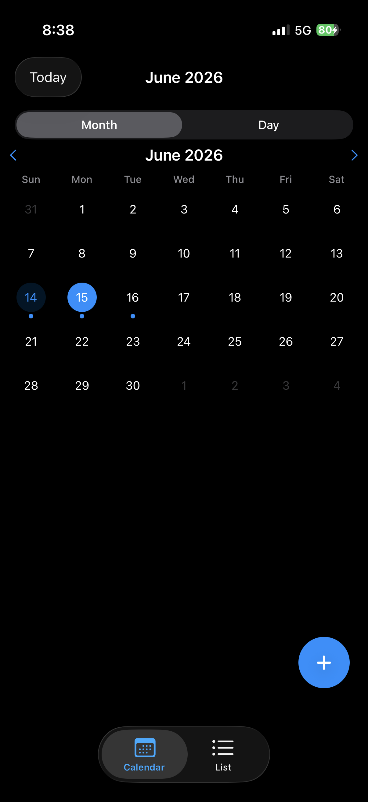
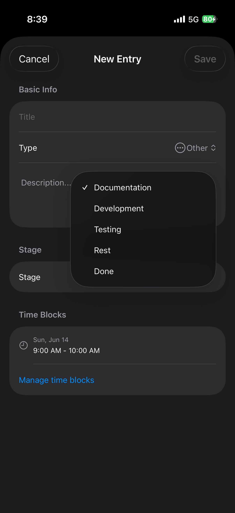

# Project Tracker

A personal project management app for iPhone that combines calendar scheduling with lightweight bug tracking. Think Google Calendar but with type-aware entries (API, Bug, Meeting, Other) that progress through a predefined stage lifecycle.

## Features

- **Month & Day Views** — Month calendar grid with day indicators, vertical timeline with time blocks
- **Entry Types** — API, Bug, Meeting, Other with color-coded icons
- **Stage Lifecycle** — Documentation → Development → Testing → Rest → Done
- **Bug Tracking** — Severity, status, and steps-to-reproduce for bug entries
- **Multiple Time Blocks** — An entry can have several time segments in a day
- **Overlap Resolution** — Concurrent entries split side-by-side on the timeline
- **Quick Stage Advancement** — Swipe in list, context menu in timeline
- **Stage Colors** — Each stage has a distinct color for visual tracking

## Tech Stack

- SwiftUI + SwiftData (iOS 18+)
- No external dependencies
- Code-generated project via XcodeGen

## Screenshots







## Setup

1. Clone the repo
2. Open `Project Tracker.xcodeproj` in Xcode 16+
3. Select your development team in **Signing & Capabilities**
4. Run on iPhone simulator or device

## Project Structure

```
Project Tracker/
├── Models/          # SwiftData models & enums
├── Views/           # SwiftUI views
│   ├── Calendar/    # Month, Day timeline
│   ├── List/        # Filterable entry list
│   ├── EntryForm/   # Create/edit form
│   └── Components/  # Reusable UI components
└── Resources/       # Assets
```
